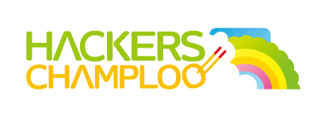

## 開催概要

ハッカーズチャンプルーは、沖縄県内のIT系ユーザグループが合同で企画する夏祭りです。全国各地からゲストをお招きし、ハッカー/エンジニア/エバンジェリスト同士が各専門分野を超えて相互交流しようという企画です。

## 開催日時

### 前夜祭：2013年8月23日夜〜

（会場：北谷[クリエイターズレジデンス](http://summer-time-studio.com/CreatorsResidence/index.html)）

### [カンファレンス](program.html)：2013年8月24日 10:00〜

（会場：琉球大学工学部1号館321&322教室）
参加費：無料

### ビーチパーティ：2013年8月24日 17:00〜
（会場未定）
参加費：実費（3千円程度）

そして謎の...[?](http://hackers-champloo.doorkeeper.jp/events/4878)

## ゲスト（先着順）

ゲスト                                                 | 協力ユーザグループ
------------------------------------------------------ | -------------------------
[丸山 不二夫](https://twitter.com/maruyama097)         | 日本Androidの会
[小飼 弾](http://blog.livedoor.jp/dankogai/)           | yomitan.pm 
[日本PostgreSQLユーザ会](http://www.postgresql.jp/) 理事長 永安 悟史                | 日本PostgreSQLユーザ会
AWSテクニカルエバンジェリスト [堀内 康弘](https://twitter.com/horiuchi) | JAWS-UG
株式会社サーバーワークス 代表取締役 [大石 良](https://twitter.com/ooishi) | JAWS-UG
アイレット株式会社 cloudpackエバンジェリスト [後藤 和貴](https://twitter.com/kaz_goto) | JAWS-UG
アイレット株式会社 cloudpackエバンジェリスト [吉田 真吾](https://twitter.com/yoshidashingo) | JAWS-UG
Javaコミュ＠九州 [きしだなおき](http://d.hatena.ne.jp/nowokay) | 日本Javaユーザーグループ
Android女子部 [矢野りん](https://twitter.com/yanorin)          | Android女子部

### 主催 [ハッカーズチャンプルー実行委員会](about.html) 

### 後援 沖縄県
