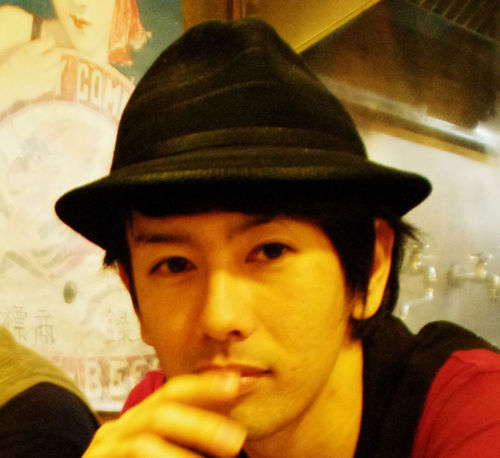
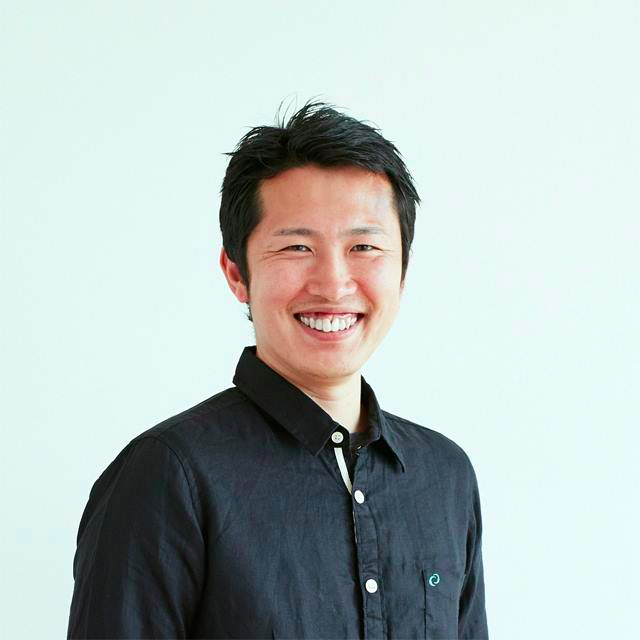
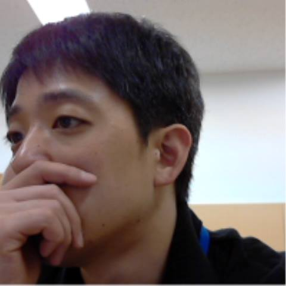

プログラム
--------------------------------------------------------------------------------

調整中の事項につきましては詳細が決定次第更新致します。

### ゲスト（先着順）

ゲスト                                                 | 協力ユーザグループ
------------------------------------------------------ | -------------------------
[丸山 不二夫](https://twitter.com/maruyama097)         | 日本Androidの会
[小飼 弾](http://blog.livedoor.jp/dankogai/)           | yomitan.pm 
[日本PostgreSQLユーザ会](http://www.postgresql.jp/) 理事長 永安 悟史                | 日本PostgreSQLユーザ会
AWSテクニカルエバンジェリスト [堀内 康弘](https://twitter.com/horiuchi) | JAWS-UG
株式会社サーバーワークス 代表取締役 [大石 良](https://twitter.com/ooishi) | JAWS-UG
アイレット株式会社 cloudpackエバンジェリスト [後藤 和貴](https://twitter.com/kaz_goto) | JAWS-UG
アイレット株式会社 cloudpackエバンジェリスト [吉田 真吾](https://twitter.com/yoshidashingo) | JAWS-UG
Javaコミュ＠九州 [きしだなおき](http://d.hatena.ne.jp/nowokay) | 日本Javaユーザーグループ
Android女子部 [矢野りん](https://twitter.com/yanorin)          | Android女子部

### 前夜祭

* 日時: 2013年8月23日夜
* 場所: 北谷[クリエイターズレジデンス](http://summer-time-studio.com/CreatorsResidence/index.html)
* 参加費:500円

<a href="http://hackers-champloo.doorkeeper.jp/events/4875" target="_blank" class="css3button">前夜祭申込！</a>

### カンファレンス

* 日時: 2013年8月24日 10:00
* 場所: 琉球大学工学部1号館321&322教室
* 参加費: 無料

<a href="http://hackers-champloo.doorkeeper.jp/events/4876" target="_blank" class="css3button">カンファレンス申込！</a>

開始時刻 | 時間 | 登壇者 | トラックタイトル | 概要
-------- | ---- | ------ | ---------------- | -------------------------
10:00-   | 5    | - | オープニング | ゲストのご紹介
10:05-   | 10   |  JavaKuche [平良 知広](https://twitter.com/Tomohiro) | JavaKuche総会 | JavaKuche活動内容のご報告
10:15-   | 45   |  Javaコミュ＠九州  [きしだ なおき](http://d.hatena.ne.jp/nowokay) | Java8で変わるプログラミングスタイル | Lambdaの基本的な文法の紹介と、標準ライブラリでLambdaが前提となっているもの、そこから変わるプログラミングスタイルの変化
11:00-   | 55  |  [丸山 不二夫](https://twitter.com/maruyama097) | Packaged Web Appについて --- AndroidとChromeの統合 | 現在、アプリ開発のスタイルに大きな変化が起きようとしています。HTML, CSS, JavaScriptといったWebの標準技術をクライアント側のアプリに応用しようと言う流れが大きくなっています。そうしたクライアント・サイドのWebアプリは、現在、Packaged Web Appというスタイルでまとめられています。講演では、Packaged Web Appの代表的な取り組みとして、Google Chromeのアプローチを紹介し、Googleのこうした動きが、AndroidへのPackaged Web Appの導入を大きな目標としているという予想を述べたいと思います。
12:00-   | 60 | お昼休憩
13:00-   | 50 |  [小飼 弾](http://blog.livedoor.jp/dankogai/) | 調整中 | 調整中
13:50-   | 15 |  AWSテクニカルエバンジェリスト [堀内 康弘](https://twitter.com/horiuchi) | 調整中 | 調整中
14:05-   | 15 |  株式会社サーバーワークス 代表取締役 [大石 良](https://twitter.com/ooishi) | 調整中 | 調整中
14:20-   | 15 |  アイレット株式会社 cloudpackエバンジェリスト [吉田 真吾](https://twitter.com/yoshidashingo) | 調整中 | 調整中
14:35-   | 15 |  JAWS-UG沖縄 [西島 幸一郎](https://twitter.com/k_nishijima) | 調整中 | 調整中
14:50    | 10 | 休憩
15:00-   | 45 |  [日本PostgreSQLユーザ会](http://www.postgresql.jp/) 理事長 永安 悟史 | 調整中 | 調整中
15:45-   | 45 |  [矢野りん](https://twitter.com/yanorin) | meets 沖縄IT系女子 | 調整中
16:30-   | 10 |  JAWS-UG沖縄 [米須 渉](https://twitter.com/asumaslv) | クロージング

### ビーチパーティ

* 日時: 2013年8月24日 17:00〜（会場未定）
* 場所: 調整中
* 参加費: 実費（3千円程度）

<a href="http://hackers-champloo.doorkeeper.jp/events/4877" target="_blank" class="css3button">ビーチパーティー申込！</a>

