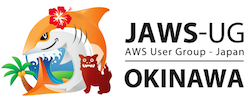
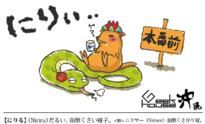
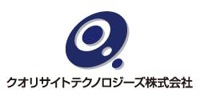

スポンサー募集について
--------------------------------------------------------------------------------

ハッカーズチャンプルー実行委員会では、以下のとおりスポンサーを募集しています。

### イベントスポンサー

資格、特典       |                            |
---------------- | -------------------------- |
金額             | 3万円から（要相談）        |
セッション発表枠 | 1つ確保                    |
その他           | 公式サイトにバナー広告掲載、休憩時間にCM再生等 |

イベントスポンサーにご興味のある団体様は、是非[お問い合わせ](https://docs.google.com/forms/d/1MGJ4bVv8hpyXeLjvcGzZDpl838ZGHPA_plLqX_BJSbA/viewform)下さい。

### メディアスポンサー

条件

* オンラインまたはオフラインで情報発信できるメディアであること
* イベント前の告知にご協力いただけること（方法については要相談）
* 前夜祭またはカンファレンス当日に現地取材が可能であること

詳細につきましては、[お問い合わせ](https://docs.google.com/forms/d/1MGJ4bVv8hpyXeLjvcGzZDpl838ZGHPA_plLqX_BJSbA/viewform)下さい。

-----

### イベントスポンサー 一覧（先着順）
 アイレット株式会社 http://www.iret.co.jp/

cloudpackでは、アクセス負荷が高いサイト、一定期間だけアクセスが跳ね上がるサイトなどに最適なアマゾンクラウドの利用をサポートします。サーバの構築・管理・保守、24時間の監視、バックアップ（2世代分）に、クラウド利用料金を含むパッケージをご用意し、アクセスの多いサイトでも高速かつ安定したコンテンツ配信をご提供します。

-----

 株式会社サーバーワークス http://www.serverworks.co.jp

2008年からAWSに特化したインテグレーションサービスを提供している当社は、「エンタープライズAWS」をご紹介します。ガバナンス、セキュリティ、インシュアランスという強い経営に欠かせないＩＴ環境を実現してみませんか。

-----

 株式会社ディーワークス http://www.symbigun.com/

AWSテクノロジーパートナーでもある当社がお届けする、スマートフォンアプリのユーザー利用状況分析サービス“Symbigun（シンビガン）”は、専門的知識がない方でも無料から簡単に、アプリの分析ができるサービスです。iOSアプリ、Androidアプリを起動したユーザーの端末、メーカーやOSのバージョンなどを、ユニークユーザー数を軸に解析し、直観的でわかりやすいグラフで表示します。

-----

 株式会社SummerTimeStudio http://www.summer-time-studio.com/

サマータイムスタジオは、ゲーム開発の民主化を掲げるゲームエンジン「Unity」を全作品に採用し、家庭用ゲームメーカー出身のクリエイターを中心として、家庭用ゲーム開発で培った技術や経験を「Unity」に融合させ、高いゲームクオリティと表現力を実現しました。さらに、独自の手法によりゲーム開発の効率化を追求し、これまでに、自社タイトル及び他者受託タイトルにて、約20タイトルの開発実績を持っています。
2013年には、沖縄県内の新オフィスへ移転し、コワーキングカフェやコーヒーショップを併設する開発スタジオを開設しており、今後もスマートフォン向けに、シンプルなゲーム性に高い表現を盛り込んだゲームを日本とアメリカを中心に、世界各国のユーザーへ向け、開発・提供してまいります。

-----

 JAWS-UG沖縄 http://jaws-ug.jp/bc/okinawa/

-----

 株式会社OCC http://www.occ.co.jp/

-----

 ギークハウス沖縄 http://text.geeoki.com/

-----

 CodeIQ https://codeiq.jp/

CodeIQ（コードアイキュー）」は、第一線で活躍するITエンジニアが出題した問題に一般ユーザーが無料で“挑戦”し、そのアンサーに対して出題エンジニアから評価フィードバックをもらえるサービスです。

これまでに「1.4万人」以上が問題に挑戦済み。

社会一般から見たITスキルではなく、その出題エンジニアに自分のスキルがどのように評価されるのかを知ることができます。

-----

  http://www.ohns.co.jp

-----

 株式会社レキサス http://lexues.co.jp

株式会社レキサスは、企画、開発、運営、インフラ全てに精通した沖縄発のIT企業です。常に最新のトレンドをキャッチアップしつつ、オリジナル商品にこだわった製品・サービスを展開しております。そのためサービスの企画から、開発、デザイン、そしてその後の運営に至るまで、ワンストップでサポートいたします。

-----

 クオリサイトテクノロジーズ株式会社 http://www.qualysite.co.jp
