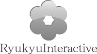

スポンサー募集について
--------------------------------------------------------------------------------

ハッカーズチャンプルー実行委員会では、以下のとおりスポンサーを募集しています。

### セッションスポンサー

セッション枠をひと枠確保させていただくスポンサー枠となります（イベント内容に沿った講演テーマでのご登壇をお願い致します）。枠数は少数となりますので、ご希望の企業様はお早めにお申し出ください。

特典             |                            |
---------------- | -------------------------- |
金額             | 1口5万円から           |
セッション発表枠 | 1枠確保（質疑応答込で30-50分前後を想定）           |
その他           | 公式サイトにバナー広告掲載、休憩時間にCM再生等 |

### イベントスポンサー

セッション枠無しで、金額が3万円から（応相談）となるスポンサー枠となります。

特典             |                            |
---------------- | -------------------------- |
金額             | 3万円から（応相談）        |
その他           | 公式サイトにバナー広告掲載、休憩時間にCM再生等 |

セッションスポンサー・イベントスポンサーにご興味のある団体様は、是非[お問い合わせ](https://docs.google.com/forms/d/1MGJ4bVv8hpyXeLjvcGzZDpl838ZGHPA_plLqX_BJSbA/viewform)下さい。

### メディアスポンサー

条件

* オンラインまたはオフラインで情報発信できるメディアであること
* イベント前の告知にご協力いただけること（方法については要相談）
* 前夜祭またはカンファレンス当日に現地取材が可能であること

詳細につきましては、[お問い合わせ](https://docs.google.com/forms/d/1MGJ4bVv8hpyXeLjvcGzZDpl838ZGHPA_plLqX_BJSbA/viewform)下さい。

-----

### セッションスポンサー 一覧（先着順）

 日本仮想化技術株式会社 http://enterprisecloud.jp

### イベントスポンサー 一覧（先着順）

 株式会社SummerTimeStudio http://www.summer-time-studio.com/

サマータイムスタジオは、ゲーム開発の民主化を掲げるゲームエンジン「Unity」を全作品に採用し、家庭用ゲームメーカー出身のクリエイターを中心として、家庭用ゲーム開発で培った技術や経験を「Unity」に融合させ、高いゲームクオリティと表現力を実現しました。さらに、独自の手法によりゲーム開発の効率化を追求し、これまでに、自社タイトル及び他者受託タイトルにて、30タイトル以上の開発実績を持っています。
今後もスマートフォン向けに、シンプルなゲーム性に高い表現を盛り込んだゲームを日本とアメリカを中心に、世界各国のユーザーへ向け、開発・提供してまいります。

 琉球インタラクティブ株式会社 http://www.ryukyu-i.co.jp/

琉球インタラクティブは沖縄発のインターネットベンチャーです。
マーケティング、クリエイティブ、テクノロジーの3つの強みを活かし、積極的に新規事業を創造し、幅広い分野で事業展開をしております。

１つの事業に絞るというのが、スタートアップの鉄則かもしれませんが、「面白いと思ったことはできるだけカタチにしてみる」というのが当社流。そして、仲間もそれぞれ大きな夢を持って集まってきています。

インターネット業界を舞台にした大冒険。
それが私たちの日常です。

 JAWS-UG沖縄 http://jaws-ug.jp/bc/okinawa/
